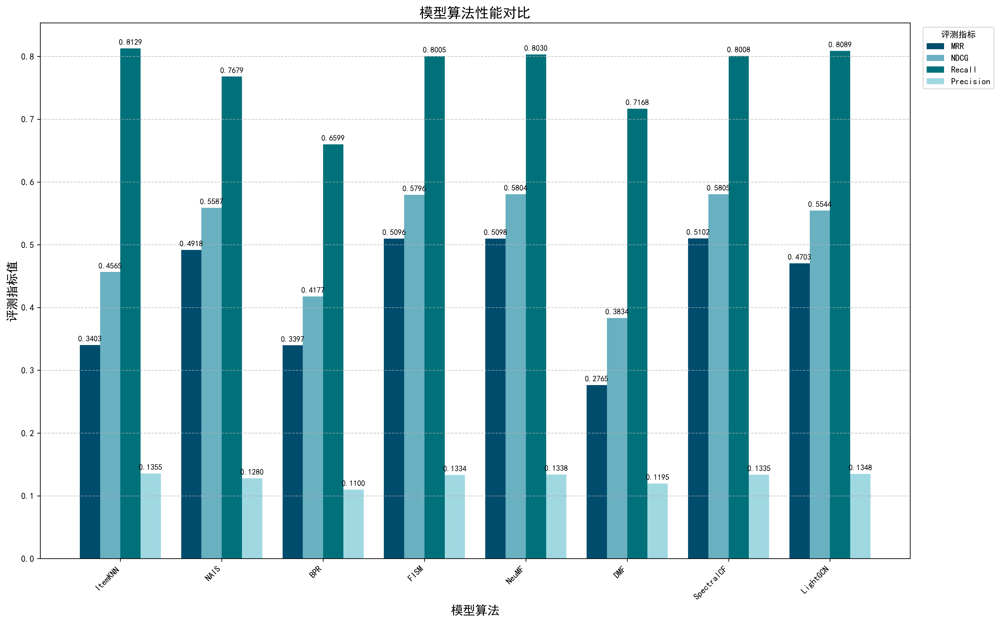
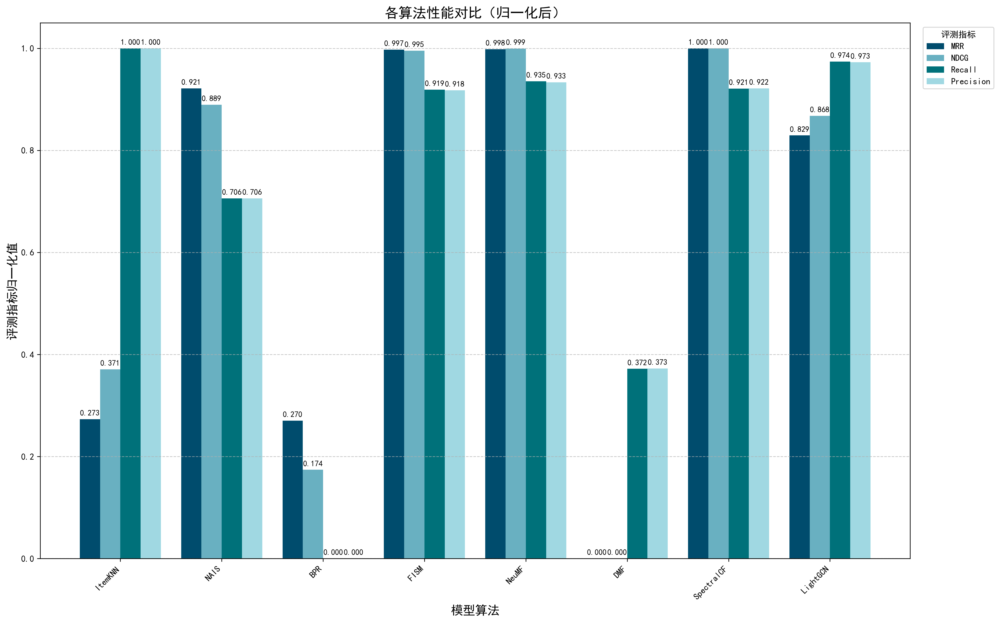
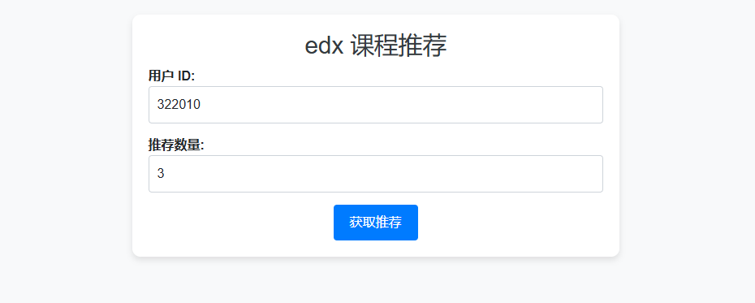
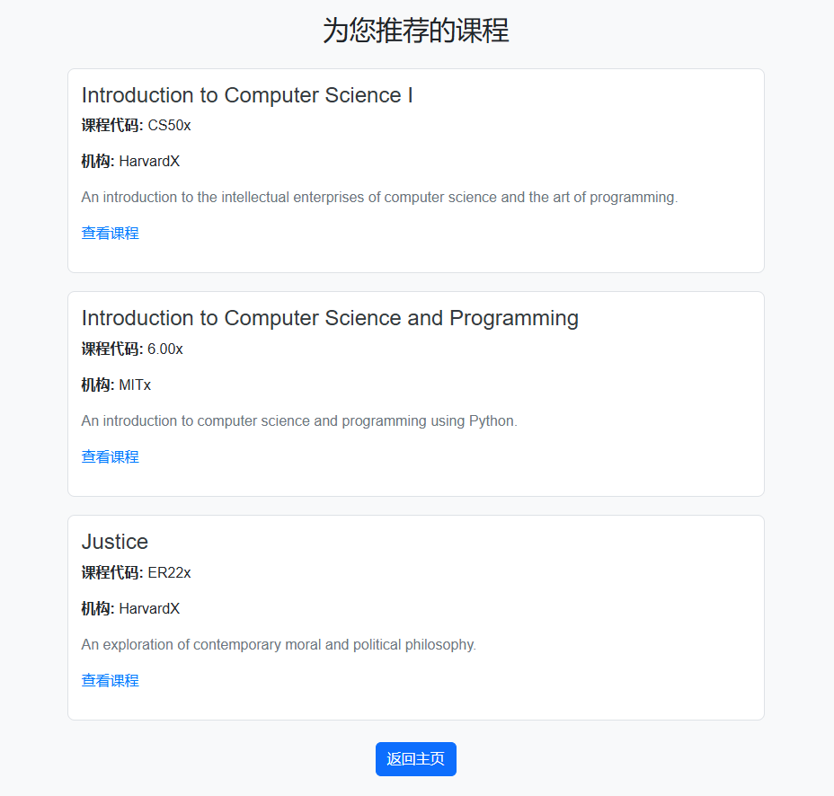
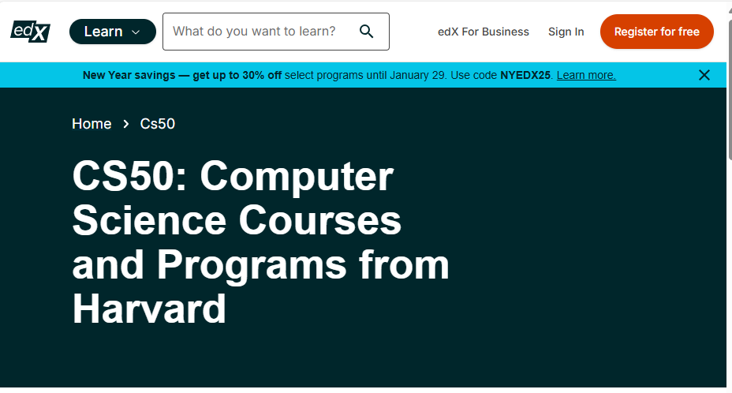

# 基于 RecBole 的课程推荐模型训练

## 工程介绍

### 项目概述
本项目基于 [RecBole](https://github.com/RUCAIBox/RecBole) 算法库，在自己构建的课程数据集上训练了推荐模型，进行了模型算法评估，并提供了能调用模型进行推理的简易 Flask 页面

主要工作如下：
- 数据集构建
  - 基于 [HarvardX and MITx: The First Year of Open Online Courses, Fall 2012-Summer 2013](https://papers.ssrn.com/sol3/papers.cfm?abstract_id=2381263) 数据集，包含 Harvard 和 MIT 在 [edx](https://www.edx.org/) 线上课程平台上的用户 - 课程交互数据
  - 参照 [HarvardX_MITx_Person_Course_Dataset_Exploration](https://github.com/RayWongGit/HarvardX_MITx_Person_Course_Dataset_Exploration) 提供的方法进行了数据清洗，并进一步处理完善
  - 构建了 hmx-400k 数据集，包含 402750 条真实的用户 - 课程交互数据，并分别提供了 323419 名用户、13 门 [edx](https://www.edx.org/) 平台课程的附加信息
- 模型训练与评估
  - 基于 [RecBole](https://github.com/RUCAIBox/RecBole) 算法库，在 hmx-400k 数据集上使用多种推荐算法分别训练模型
  - 针对多种算法分别进行了参数调优，得出了算法在数据集上的较优参数
  - 结合课程推荐任务的特点，从 4 个评测指标对 8 种 general 类型算法在该数据集上的表现进行了评估测试，并提供了测试结果可视化的方法
- 模型调用方法实现
  - 提供简单的模型调用方法，可调用模型推理，为数据集中的用户做任意数量的课程推荐
  - 为以上方法提供了简单的 Flask 页面，模拟用户在网页端使用推荐功能
  - 由于模型冷启动存在一定困难（参考 [issue#952](https://github.com/RUCAIBox/RecBole/issues/952)），这里实现的调用方法仅支持为数据集中已经存在的用户做推荐，未来可能基于协同过滤+冷启动的思想实现添加用户功能

### 目录结构
- configs：模型训练的参数，按照算法命名
- data_process：数据处理脚本
  - select_clean：读取已经预清洗过的数据文件（hmx_eda.csv, [来源仓库](https://github.com/RayWongGit/HarvardX_MITx_Person_Course_Dataset_Exploration/tree/master/data)），提取需要的字段并进一步处理
  - add_int_id.py：为上一步的结果数据文件（hmx_selected.csv）添加整型 id 字段
  - to_inter.py, to_item.py, to_user.py: 将处理好的数据文件（hmx_int_id.csv），转换为 RecBole 模型输入需要的数据集[原子文件](https://recbole.io/cn/atomic_files.html)
  - check_file.py：检查生成的原子文件编码是否合规
- dataset：模型输入数据集
  - hmx-400k：本工程构建的课程数据集
  - ml-local：RecBole 提供的示例数据集
- log：模型训练日志文件，按算法划分子目录
- recommend_run：可用于测试模型推理过程，包含 Flask 页面
- saved：保存的 .pth 格式模型文件
- visualization：可视化评估结果的脚本
- train.py：模型训练入口
- train_example_dataset.py：RecBole 提供的示例训练脚本，可用于测试环境是否正确

## 环境准备

### 1 基本环境
以下环境的版本号均为推荐，在 win11&Anaconda 测试可用，也可以根据需要选择其他版本

- conda
- python (3.10)
- torch GPU (torch 2.5.1, CUDA 12.4)

  前往 [pytorch 官网](https://pytorch.org/) ，根据包管理环境、操作系统及 CUDA 版本，选择官方推荐的安装命令，例如：
  ```shell
  conda install pytorch torchvision torchaudio pytorch-cuda=xx.x -c pytorch -c nvidia
  ```
  或选择其他镜像源自行选择需要的版本安装  

### 2 算法框架

- recbole 1.2.0

  参考 [官方仓库](https://github.com/RUCAIBox/RecBole) 指引安装，例如 conda 环境下：
  ```shell
  conda install -c aibox recbole
  ```

### 3 运行中的问题

#### 3.1 numpy

不适配 2.0.0 以后的版本，可回退到 numpy 1.26.4

#### 3.2 thop

conda 可能存在模块缺失，需要使用 pip 手动安装
```shell
pip install thop
```

#### 3.3 matplotlib

使用 PyCharm 时，新版本可能不适配图形后端，可回退到 matplotlib 3.7.1

## 模型训练

### 数据集准备
使用本数据集训练时，需要确保 `dataset` 目录下正确包含 hmx-400k 数据集，示例目录结构如下：
- dataset
  - hmx-400k
    - hmx-400k.inter
    - hmx-400k.item
    - hmx-400k.user

### 启动训练
- 模型训练入口为 `train.py`，需正确配置参数文件路径，并选择模型算法和数据集
- `config` 目录下的参数文件均已经过调优，可直接使用，或参考官网[模型介绍](https://recbole.io/docs/user_guide/model_intro.html)以及[参数建议](https://recbole.io/hyperparameters/index.html)进行修改
- 如果暂未配置参数，仅仅测试训练环境，可以直接运行 `train_example_dataset.py` 在 ml-local 数据集上使用 BPR 算法运行训练
- 训练开始后，训练日志保存在 `log` 目录下，训练好的模型保存在 `saved` 目录下

**注意**：

训练 SpectralCF, LightGCN 等包含图结构模型时，可能出现环境版本冲突导致 `_update` 方法报错，可以进入对应库文件下，将 `A._update(data_dict)` 替换为：
```python
for (row, col), value in data_dict.items():
    A[row, col] = value
```
其他问题可参考 [RecBole 官方仓库](https://github.com/RUCAIBox/RecBole) 的 Issues

## 评估测试
- 模型训练完成后，最后两行输出即为在验证集和测试集上的 evaluation 结果
- `visulization` 目录下提供了将测试集评估结果可视化的脚本

参与评估测试的 general 类模型列表（根据算法分类）：

- 基于相似度的方法
  - ItemKNN (Item-based Nearest Neighbor)
  - NAIS (Neural Attentive Item Similarity Model)
- 隐式反馈优化方法
  - BPR (Bayesian Personalized Ranking)
  - FISM (Factored Item Similarity Model)
- 神经网络与深度学习方法
  - NeuMF (Neural Matrix Factorization)
  - DMF (Deep Matrix Factorization)
- 图结构建模方法
  - SpectralCF (Spectral Collaborative Filtering)
  - LightGCN (Light Graph Convolution Network)

### 测试集上的结果
测试条件：Top-K = 6

| 模型       | MRR    | NDCG   | Recall | Precision |
| ---------- | ------ | ------ | ------ | --------- |
| ItemKNN    | 0.3403 | 0.4565 | 0.8129 | 0.1355    |
| NAIS       | 0.4918 | 0.5587 | 0.7679 | 0.128     |
| BPR        | 0.3397 | 0.4177 | 0.6599 | 0.11      |
| FISM       | 0.5096 | 0.5796 | 0.8005 | 0.1334    |
| NeuMF      | 0.5098 | 0.5804 | 0.803  | 0.1338    |
| DMF        | 0.2765 | 0.3834 | 0.7168 | 0.1195    |
| SpectralCF | 0.5102 | 0.5805 | 0.8008 | 0.1335    |
| LightGCN   | 0.4703 | 0.5544 | 0.8089 | 0.1348    |

### 可视化结果
原始数据：



各指标归一化后的数据：



## 模型调用

- 考虑冷启动的便捷性，本项目只实现了 general 类模型的调用
- 由于 github 不允许提交 100M 以上的文件，仓库中不提供模型文件

### 简单测试
直接在 `recommend_run/recommend_test.py` 中选择模型、用户 id 和要推荐的课程数，控制台输出结果

**注意**：

- 模型只能在当前目录下寻找数据集，因此运行模型调用的目录下也需要有一个 `dataset` 目录
- 输入的用户 id 范围为 1~323419，推荐课程数范围为 1~13

**Tips**：如果不希望每次调用模型都加载日志，可以进入库文件的 `quickstart.py`，在 `load_data_and_model` 方法中把和 logger 有关的代码全部注释掉，加载模型就不会有日志输出了

### 运行 Flask 页面
安装任意版本的 Flask 环境，直接运行 `app.py`，浏览器访问控制台给出的本地环回地址，即可进入推荐系统页面

请求页：


推荐页：


点击链接跳转：

